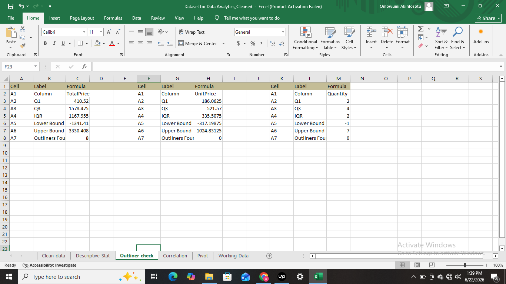

# Ecommerce-exploratory-data-analysis - Project 2
Exploratory Data Analysis (EDA) of 1,200 E-Commerce Orders

## Overview
This project explores a cleaned e-commerce dataset containing 1,200 customer orders. The objective was to transform raw transactional data into actionable business insights using Microsoft Excel.
This project uncovers hidden patterns, trends, and outliers through Exploratory Data Analysis (EDA). The goal was to move beyond raw numbers and extract meaningful business insights using descriptive statistics, outlier detection, correlation analysis, and pivot table summaries.

## Tools Used
Microsoft Excel (Analysis ToolPak, PivotTables, PivotCharts)

## Dataset
The dataset was cleaned in Project 1 before this analysis. It contains 1,200 rows and 14 columns: OrderID | Date | CustomerID | Product | Quantity | UnitPrice | ShippingAddress | PaymentMethod | OrderStatus | TrackingNumber | ItemsInCart | CouponCode | ReferralSource | TotalPrice

## Workbook Structure
| Worksheet        | Description                                    |
| ---------------- | ---------------------------------------------- |
| Clean_data       | Cleaned dataset used for analysis              |
| Descriptive_Stat | Statistical summary of numerical variables     |
| Outlier_check    | IQR-based outlier detection                    |
| Correlation      | Pearson correlation matrix                     |
| Pivot            | PivotTables and PivotCharts                    |
| Working_Data     | Supporting calculations and analysis workspace |

## Analysis and Findings
1. Descriptive Statistics
Descriptive statistics answer the basic question: "What does a typical order look like, and how much do orders vary?" without needing to examine every single row individually.

Summary Statistics
| Metric             | TotalPrice | UnitPrice | Quantity | ItemsInCart |
| ------------------ | ---------: | --------: | -------: | ----------: |
| Mean               |  $1,053.97 |   $356.41 |     2.95 |        5.49 |
| Median             |    $823.62 |   $364.21 |     3.00 |        5.00 |
| Standard Deviation |    $819.86 |   $197.18 |     1.41 |        2.28 |
| Minimum            |     $11.39 |    $11.39 |        1 |           1 |
| Maximum            |  $3,456.40 |   $699.93 |        5 |          10 |

Key Insight: The distribution of TotalPrice is moderately right-skewed. The average order value is $1,053.97, while the median order value is $823.62, indicating that a relatively small number of high-value transactions increase the overall average.
Business Interpretation: Median order value provides a more realistic measure of typical customer spending than the mean because it is less affected by unusually large purchases.

2. Outlier Detection (IQR Method)
The IQR method works like drawing a fence around the middle 50% of your data and extending it 1.5x in both directions. Any value outside that fence is flagged as an outlier, unusual enough to stand out, but not necessarily an error.

| Variable   | Outliers Found |
| ---------- | -------------: |
| TotalPrice |              8 |
| UnitPrice  |              0 |
| Quantity   |              0 |

Key Insight: Eight transactions exceeded the upper IQR boundary for TotalPrice and were classified as outliers. No outliers were detected in UnitPrice or Quantity.
Business Interpretation: These high-value transactions are likely legitimate purchases rather than data-entry errors. They may represent premium customers or bulk purchases that deserve targeted retention strategies.

3. Correlation Analysis
Correlation measures whether two variables move together. A score close to 1.0 means a strong positive relationship (both go up together). A score close to 0 means no meaningful relationship.

| Relationship             | Correlation |Interpretation
| ------------------------ | ----------: |---------------:
| UnitPrice ↔ TotalPrice   |       0.717 |Strong — expensive products lead to expensive orders
| Quantity ↔ TotalPrice    |       0.615 |Moderate — ordering more items generally increases spend
| ItemsInCart ↔ TotalPrice |       0.393 |Weak — browsing more items has a limited link to final spend
| Quantity ↔ UnitPrice     |       0.015 |Near zero — how many items ordered has no link to unit price

Key Insight: UnitPrice shows the strongest relationship with TotalPrice, indicating that product pricing has a greater influence on revenue than the quantity purchased.
Business Interpretation: A strategy focused on promoting premium products may generate greater revenue growth than strategies solely focused on increasing purchase quantities.

4. Pivot Table and Charts Analysis
Sales by Product

| Product | Orders |
| ------- | -----: |
| Printer |    181 |
| Tablet  |    179 |
| Chair   |    178 |
| Laptop  |    173 |
| Desk    |    170 |
| Monitor |    163 |
| Phone   |    156 |

Key Insight: Order volume is relatively balanced across all products, suggesting diversified customer demand and reduced dependence on a single product category.

Order Status

| Status    | Orders |
| --------- | -----: |
| Cancelled |    250 |
| Returned  |    247 |
| Pending   |    237 |
| Shipped   |    235 |
| Delivered |    231 |

Key Insight: Cancelled orders (250) represent the largest single status category, a 20.8% cancellation rate that warrants business investigation into why orders are being cancelled before fulfillment.

Sales Count by Payment Method

| Payment Method | Orders |
| -------------- | -----: |
| Online         |    258 |
| Cash           |    246 |
| Credit Card    |    234 |
| Debit Card     |    232 |
| Gift Card      |    230 |

Key Insight: Payment method usage is relatively even across all 5 channels, with Online slightly leading. No single payment method dominates customer preference.

Revenue by Referral Source

| Referral Source |     Revenue |
| --------------- | ----------: |
| Instagram       | $275,285.45 |
| Email           | $261,808.55 |
| Google          | $250,441.48 |
| Facebook        | $250,410.90 |
| Referral        | $226,815.58 |

Key Insight: Revenue is spread relatively evenly across all 5 referral sources, with Instagram slightly leading. No single marketing channel dramatically outperforms the others. This suggests the business is not over-reliant on any one acquisition source.

 ## Key Findings
 | Finding                                                         | Business Impact                                                           |
| --------------------------------------------------------------- | -------------------------------------------------------------------- |
| Average order value is $1,053.97                                | Customer spending is driven by a few high-value purchases            |
| Eight high-value outlier orders were identified                 | Potential VIP customer segment exists                                |
| UnitPrice has the strongest correlation (TotalPrice 0.717)      | Premium product strategies may increase revenue                      |
| Order cancellation rate is approximately 20.8%                  | Reducing cancellations could improve profitability                   |
| Revenue is distributed across multiple referral sources         | Customer acquisition channels are well diversified                   |

## Skills Demonstrated
Data Cleaning | Exploratory Data Analysis (EDA) | Descriptive Statistics | Outlier Detection (IQR Method) | Correlation Analysis | PivotTables | PivotCharts | Business Intelligence | Data Storytelling | Microsoft Excel | Analytical Thinking

## Project Deliverables
- Cleaned Dataset
- Descriptive Statistics Report
- Outlier Analysis
- Correlation Matrix
- Pivot Tables
- Pivot Charts
- Business Insights Summary

## Files
- [Dataset_for_Data_Analytics_Project 2.xlsx](Dataset_for_Data_Analytics_Project%202.xlsx) — Complete Excel workbook containing all analyses and visualizations.

## Related Projects
Project 1: Ecommerce Data Cleaning (https://github.com/Omowumi-A/Ecommerce-data-cleaning)
Project 3: SQL Analysis *(coming soon)*
Project 4: Data Visualization *(coming soon)*
